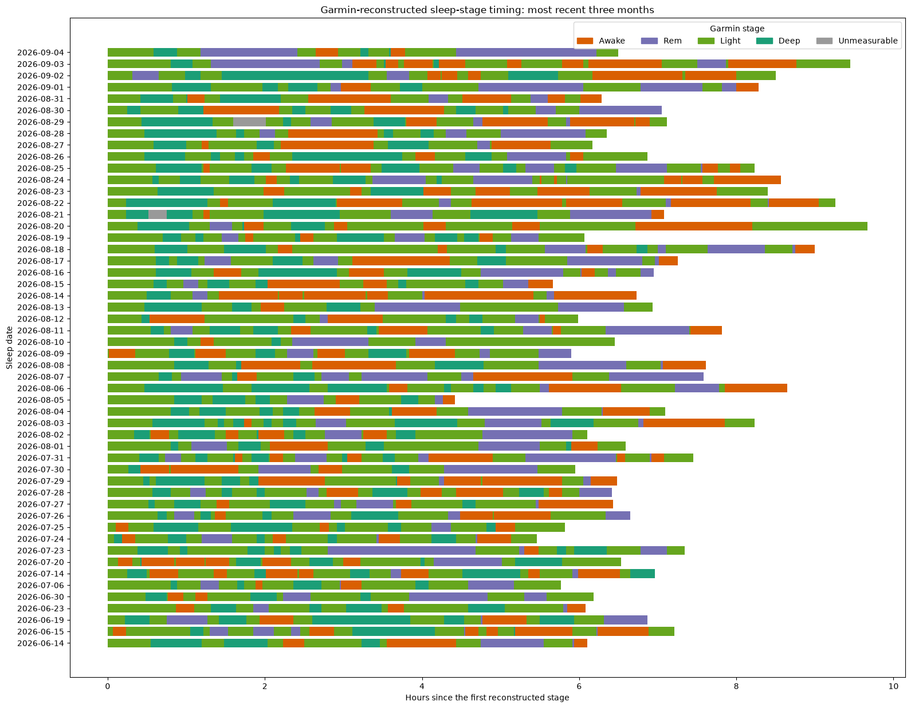
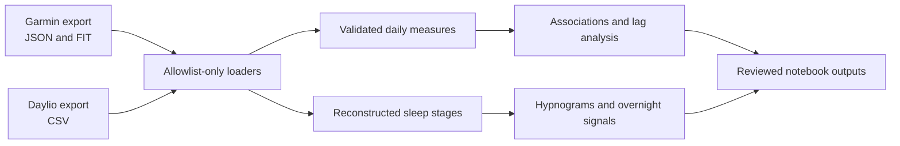
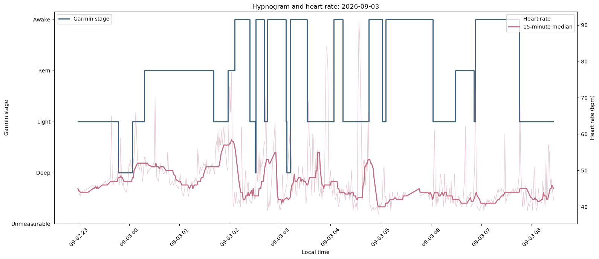
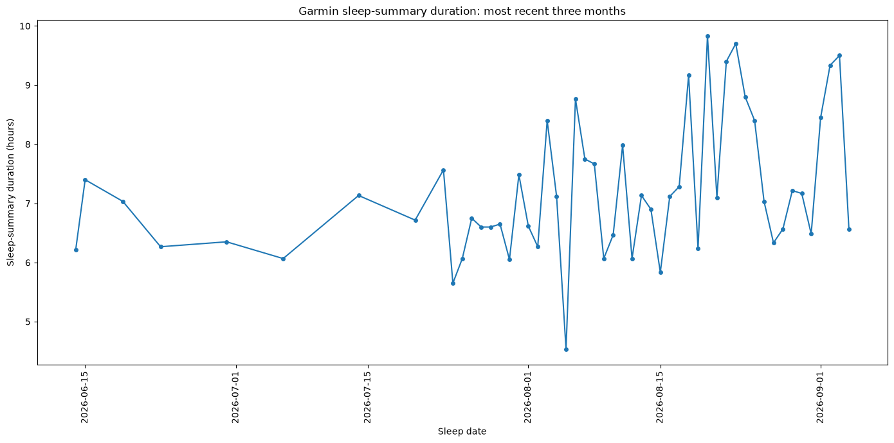
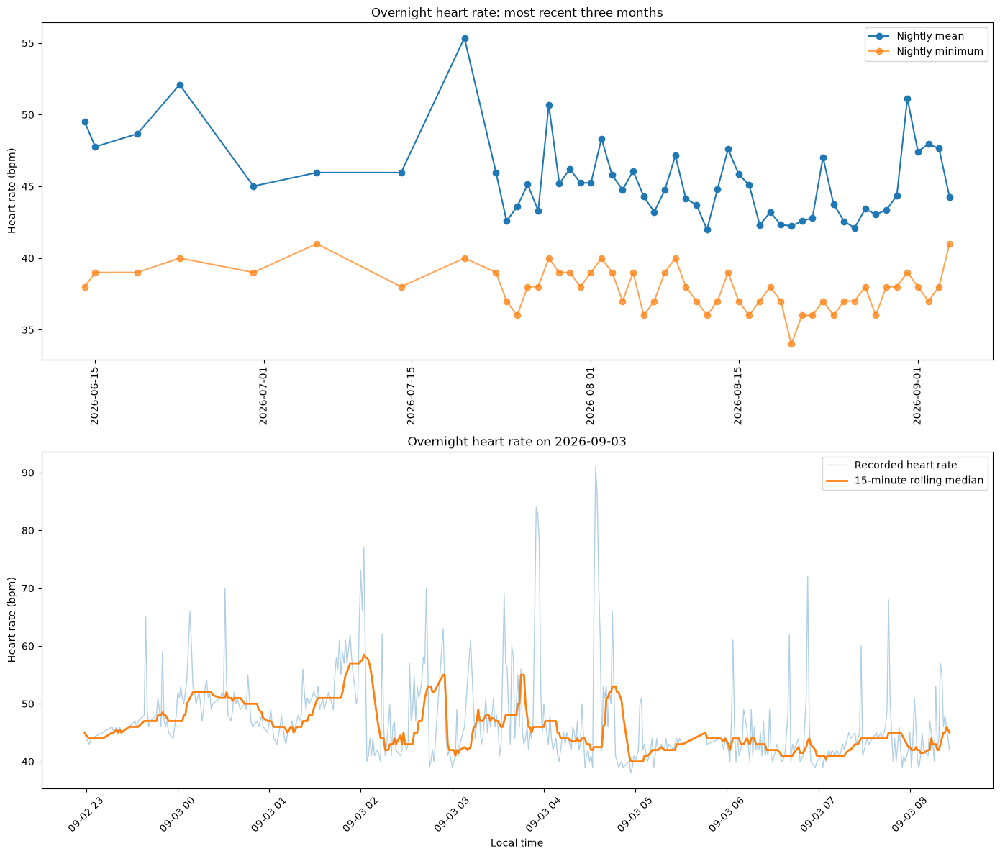
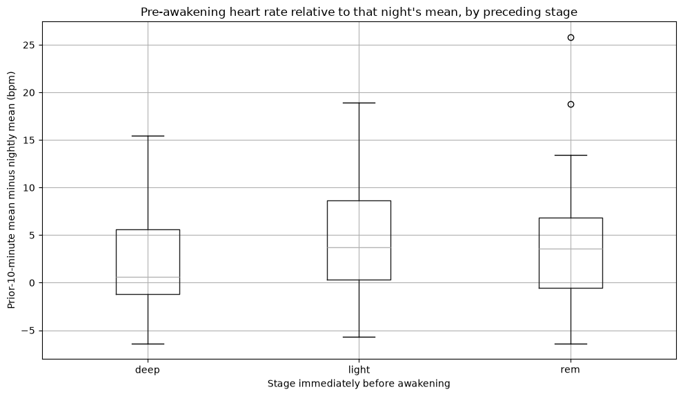
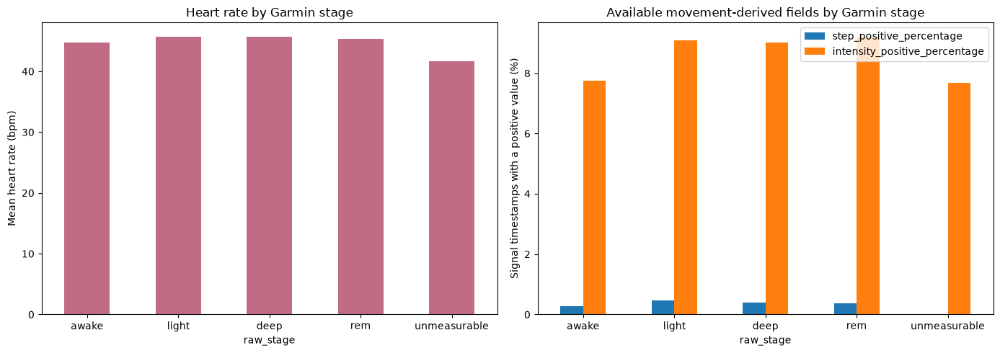
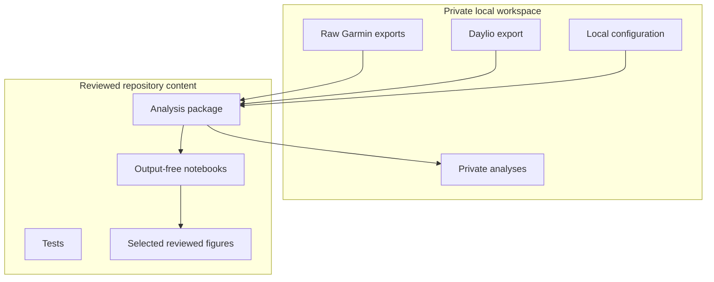

# Garmin Health Data Analysis

A reproducible Python workflow for turning Garmin exports into privacy-conscious analyses of sleep, heart rate, activity and mood. The project works directly from locally exported data, reconstructs overnight sleep-stage timelines from Garmin FIT files, and keeps the analytical steps visible in a sequence of Jupyter notebooks.



## What this project explores

- How sleep duration and overnight heart rate vary from night to night.
- When Garmin-estimated awake, light, deep and REM stages occur within each sleep window.
- Whether heart rate changes during the ten minutes preceding a detected awakening.
- How heart rate and the movement-derived fields available in Garmin exports differ by sleep stage.
- How daily Garmin measures relate to Daylio mood scores on the same day and at short time lags.
- Whether apparent associations remain after accounting for weekday, long-term trend and seasonality.

## Analysis pipeline



Raw exports and local configuration stay outside version control. The loaders select only approved fields, timestamps are normalised to the configured local timezone, and missing observations remain missing rather than being silently imputed.

## Sleep-stage reconstruction

Garmin sleep FIT files are identified by file type 49. Their timestamped stage transitions are decoded into contiguous intervals, then aligned with heart-rate and movement-derived signals from the same sleep window.

The resulting hypnogram makes it possible to inspect the timing of each estimated stage alongside the recorded heart rate:



Garmin stages are wearable-derived estimates rather than clinical EEG measurements. The reconstruction preserves the exported labels without treating them as diagnoses or exact measurements of brain state.

## Recent sleep and heart-rate patterns

| Sleep-summary duration | Overnight heart rate |
| --- | --- |
|  |  |

The notebooks deliberately focus recent sleep views on the latest three months. This keeps the charts readable while retaining the full local data for other analyses.

## Awakenings, heart rate and movement

The fragmentation analysis compares the mean heart rate during the ten minutes before each Garmin-labelled awakening with that night's overall mean. Events are also grouped by the stage immediately preceding the transition.

| Heart rate before awakenings | Signals available by stage |
| --- | --- |
|  |  |

These comparisons are descriptive. An elevated heart rate before an awakening may be compatible with physiological arousal, but the wearable data alone cannot identify its cause. The export contains higher-level fields such as steps, activity type and intensity rather than raw accelerometer samples.

## Notebook guide

| Notebook | Purpose |
| --- | --- |
| `01_data_inventory.ipynb` | Validate the joined daily dataset, missingness and plausible ranges. |
| `02_exploratory_trends.ipynb` | Explore mood distributions and daily activity patterns. |
| `03_same_day_associations.ipynb` | Estimate same-day associations with block-bootstrap intervals and multiple-testing correction. |
| `04_lagged_associations.ipynb` | Compare Garmin measures with mood at several day-level lags. |
| `05_adjusted_robustness.ipynb` | Fit adjusted ordinal models and compare alternative mood summaries. |
| `06_sleep_data_inventory.ipynb` | Inspect recent sleep coverage, duration and overnight heart rate. |
| `07_sleep_fragmentation.ipynb` | Reconstruct stage timing and analyse awakenings, heart rate and movement-derived fields. |

## Statistical approach

- Spearman correlations for monotonic relationships without assuming normally distributed measurements.
- Contiguous seven-day block bootstrapping to retain some short-range dependence between neighbouring days.
- False-discovery-rate adjustment across related families of tests.
- Lagged comparisons in which positive lag means the Garmin measurement precedes the mood date.
- Adjusted ordinal models incorporating weekday, long-term trend and annual seasonality.
- Sensitivity checks using daily mean, median and final mood check-in.

Results are treated as associations, not causal effects. The analysis also reports sample sizes because coverage differs between exported measures.

## Running the project

Python 3.11 or newer is required.

```powershell
python -m venv .venv
.\.venv\Scripts\Activate.ps1
python -m pip install --upgrade pip
python -m pip install -e ".[dev]"
pre-commit install
```

Copy `config.example.toml` to the untracked `config.local.toml`, then point it at the Garmin export directory and Daylio CSV on your own machine. Launch the notebooks with:

```powershell
jupyter lab
```

Run the automated checks with:

```powershell
pytest
python scripts/smoke_test_notebooks.py
python scripts/verify_public_repo.py
```

## Privacy model

The repository is designed around a separation between reproducible analysis and private source data:



Raw exports, local paths, private reports and unrestricted executed notebooks are ignored by Git. Only figures that have been deliberately reviewed for publication belong under `docs/images/`.

## Repository layout

| Path | Contents |
| --- | --- |
| `src/garmin_daylio_analysis/` | Loading, validation, preparation, statistics and sleep reconstruction code. |
| `notebooks/` | Ordered, reproducible analysis notebooks. |
| `tests/` | Unit tests for privacy boundaries, loaders, statistics and FIT reconstruction. |
| `scripts/` | Notebook smoke tests and a pre-publication safety check. |
| `docs/images/` | Deliberately selected figures used in this README. |

## Limitations

- Garmin's stage classifications are estimates derived from wearable signals, not polysomnography.
- Coverage depends on which records Garmin includes in a particular export.
- Observational associations can be affected by confounding, reverse timing and multiple comparisons.
- A single person's repeated measurements can be informative for exploration but do not automatically generalise to other people.
